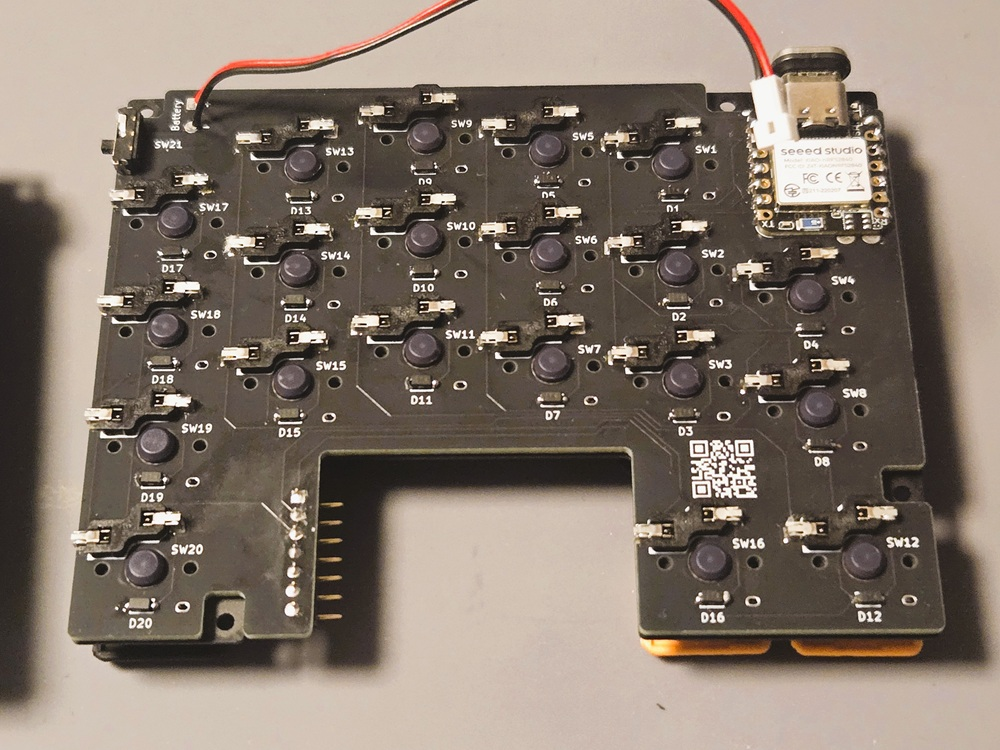
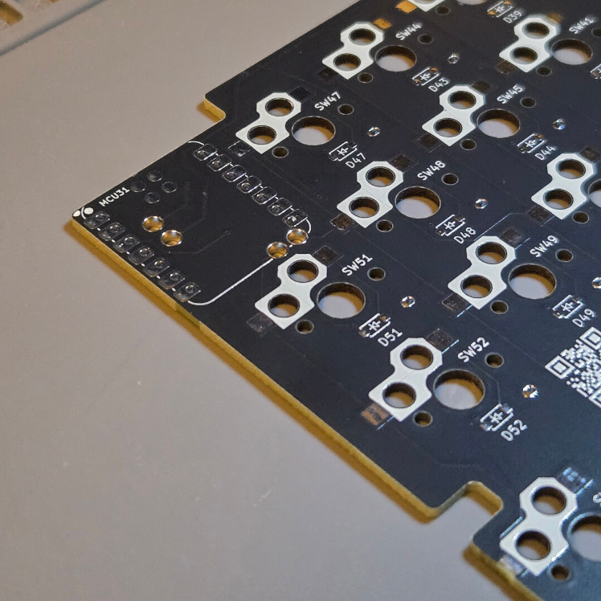

# ビルドガイド

## 0. 準備
### 内容物
内容物がそろっていることをご確認ください。
|品名|数量|備考|
|---|---|---|
|メイン基板|1セット||
|Kailh Switch Socket|42個|ロープロファイル用|
|ダイオード|44個|予備（2個）|
|スライドスイッチ|2個|電源スイッチ|
|JST1.25mmコネクタケーブル|2本|バッテリー接続用|
|水平ロータリーエンコーダ（クリック付き）|1個|[THQWGD001C](https://tarohayashi.booth.pm/items/5967252) [^1] |
|BLEマイコン|2個|Seeed Studio XIAO nRF52840|
|7ピンL字コンスルー|1個||
|トラックボール読取り基板|1個|roBaオープンソース使用[リンク](https://github.com/kumamuk-git/roBa/tree/main/pcb/pmw3610_breakout_for_roBa) [^2]|
|トラックボールセンサ|1個|PMW3610DM|
|トラックボールセンサレンズ|1個||
|トッププレート|1セット|アルミ|
|トップケース|1セット|3Dプリンタ製|
|ボトムケース|1セット|3Dプリンタ製|
|ボトムプレート|1セット|3Dプリンタ製|
|ネオジウム磁石 R3×1mm|8個|ボトムプレートに取付済|
|ネオジウム磁石 R3×2mm|8個|ボトムケースに取付済|
|M2×4mm 低頭精密小ねじ|26個|予備（2個）|
|樹脂スペーサー 6mm|8個||
|M2×5mmプラスチックネジ|8個|トッププレート固定用|
|M1.7×5ｍｍ 低頭精密小ねじ|2個|トラックボールケース取付用|
|ポロンシート|2枚||
|滑り止めシール|8枚|+GRIPLUS+|

### ご準備いただく物
|品名|数量|備考|商品例|
|---|---|---|---|
|キースイッチ|42個|ロープロファイル用(Choc V2系)|[Hades Low-profile Switches](https://www.lofree.co/products/hades-low-profile-pom-switches)|
|キーキャップ|42個|17mmピッチ対応品|[Kotori Blank(Proto)](https://booth.pm/ja/items/6781056)|
|トラックボールケース|1個|25mm用がおすすめ|[Kinoyaさん](https://kinoya.booth.pm/items/6064755)|
|トラックボール|1個|サイズはトラックボールケースに合わせてご準備ください|[M-B25RD](https://www.elecom.co.jp/products/M-B25RD.html)|
|リチウムイオンバッテリー|2個|厚さ4mm以下、JST1.25mmコネクタ|[Amazonリンク](https://www.amazon.co.jp/dp/B0D4VK35RJ?ref=ppx_yo2ov_dt_b_fed_asin_title)|

### 組立てに必要な道具
|品名|備考|
|---|---|
|はんだ付けセット|私は[Kz流はんだ付け](https://note.com/kazu_dob/n/nd0040b07fc6e)を見て、自分に必要そうな物を買いました|
|ドライバー|M2には#1、M1.7には#0が適している|
|ピンセット||
|マスキングテープ|はんだ付け時の部品固定に|
|ペンチ||

## 1. 半田付け
### 1.1. メイン基板
半田付け完了した状態が下記ですので、完成図を見ながら、半田付けをするとミスを減らせると思います。
  

#### 1.1.1. キーソケット、ダイオード
　(1) 片側のパッドに半田を盛る\
　　    

　(2) 基板のプリントの形に合わせて、キーソケットとダイオードを配置する（ダイオードの向きが分かりにくいので注意）\
　　

　(3) キーソケットは半田を溶かしながら、ピンセットで軽く押さえて、基板とソケットをくっつける\
　　

　(4) ダイオードは半田を溶かしながら、ピンセットでダイオードを近づけ、事前に盛った半田に足をくっつける\
　　

　(5) 反対側も半田付けを行う

　(6) 最初に半田を盛った側も必要に応じて、半田を追加し、形を整える（フラックスを塗ると整えやすい）

#### 1.1.2. マイコン
　(1) 付属のピンヘッダをマイコンに取り付ける\
　　

　(2) メイン基板のマイコン取付穴にピンヘッダを通して、マイコンを固定する\
 　　

　(3) マイコンのパッドを1か所だけ半田で仮止めし、基板とマイコンに隙間がないことを確認する\
　　<ins>※ピンヘッダを半田付けしないように気を付ける</ins>\
　　

　(4) 反対側も仮止めし、隙間がなければ、ピンヘッダを外して、すべてパッドを半田付けする

　(5) 基板を裏返す
  
　(6) マイコンの裏パッドの位置にスルーホールが4か所あるため、裏パッドを温め、半田を付けることを意識しながら、半田を流す\
　　<ins>※スルーホールに半田の膜が張るぐらいがちょうど良い</ins>\
　　  

#### 1.1.3. スライドスイッチ
　(1) キーソケットが付いている面にスイッチ部が来るように、基板の穴に足を通す\
　　<ins>※取付面を間違えやすいので、要注意</ins>\
　　

　(2) 基板から飛び出している足をニッパーで切る

　(3) 傾いたり、基板と隙間ができないように気を付けながら、はんだ付けを行う\
　　<ins>※マスキングテープで固定し、物を使って基板を水平に浮かせて、はんだ付けをすると良い</ins>

#### 1.1.4. バッテリーケーブル
　(1) バッテリーケーブル取付け穴に半田を流して、膜を張る\
　　  
  
　(2) 半田を溶かしながら、＋側に赤のケーブル、－側に黒のケーブルを挿す\
　　  

#### 1.1.5. 7ピンL字コンスルー
　(1) キーソケットが付いている面と逆側から<ins>直線のピン</ins>を穴に通し、マスキングテープ等で固定する\
　　<ins>※取付面を間違えやすいので、要注意</ins>\
　　

　(2) 両端の2か所だけ半田で仮止めし、基板とコンスルーに隙間がないことを確認する\
　　隙間がある場合は、基板を水平に浮かせて、仮止め個所をコテで温めて、調整する

　(3) 問題がなければ、すべてのピンを半田付けする

#### 1.1.6. ロータリーエンコーダ
　(1) [THQWGD001Cのビルドガイド](https://github.com/Taro-Hayashi/THQWGD001/blob/main/assemble_c.md)を参照し、キーソケットが付いている面と逆側にロータリーエンコーダを取り付ける

　(2) エンコーダの足（3本）とスイッチの足（4本）を半田付けする

### 1.2. トラックボール読取り基板

半田付け完了した状態が下記ですので、完成図を見ながら、半田付けをするとミスを減らせると思います。\
  

　(1) トラックボールセンサを基板に取り付ける\
　　<ins>※部品の向き、取付面に気を付ける</ins>

　(2) 対角になるように2か所だけを半田で仮止めする

　(3) 基板とセンサに隙間がある場合、センサを押さえつけながら、仮止めした半田を溶かして、調整する

　(4) 問題がなければ、すべてのピンを半田付けする\
　　<ins>※間隔が狭いため、ブリッジしないように気を付ける</ins>\
　　

　(5) センサの保護シールをはがし、レンズを取り付ける\
　　

　(6) 7ピンL字コンスルーにトラックボール読取り基板を取り付ける（半田付け不要）

## 2. ケース組立て
　(1) トップケースとボトムケースを重ねる
  
　(2) ボトムケース側に六角形のネジ穴があるため、トップケース側からねじ止めする（片側8か所）
  
　(3) 六角スペーサを取付け用の台にはめて、ボトムケース側からねじ止めする（片側4か所）
  
　(4) トップケースにポロンシートを敷く
  
　(5) 基板のバッテリーケーブルを穴に通して、基板をトップケース内に入れる
  
　(6) トッププレートをかぶせて、六角スペーサの位置でねじ止めする

　(7) ボトムケース内でバッテリーをマスキングテープ等を使用して、固定する
 
　(8) ボトムプレートはマグネットで取付け可能

　(9) お好みで、滑り止めをマグネットが見えなくなるように貼り付ける

## 3. ファームウェア
### 3.1. ファームウェアのダウンロード
　(1) [ファームウェアのリポジトリ](https://github.com/r-Keys-kbd/zmk-config-KUKEY42)にアクセスする
 
　(2) "Actions"タブを開く

　(3) 最新のWorkflowを開く

　(4) ArtifactsのFirmwareをクリックするとダウンロードが開始される

　(5) ダウンロードしたZIPファイルには下記3つのファイルが入っている
|ファイル名|備考|
|---|---|
|KUKEY42_L rgbled_adapter-seeeduino_xiao_ble-zmk.uf2|左側用ファームウェア|
|KUKEY42_R rgbled_adapter-seeeduino_xiao_ble-zmk.uf2|右側用ファームウェア|
|settings_reset-seeeduino_xiao_ble-zmk.uf2|リセット用ファームウェア|
   

### 3.2. リセット用ファームウェアの書込み
　(1) PCとマイコンをUSB Type-Cケーブルで接続する
  
　(2) ボトムプレートを外し、マイコンがある位置の左側の穴に爪楊枝等を挿して、マイコンのリセットボタンをダブルクリックする
  
　(3) 「XIAO SENSE」ドライブのエクスプローラーが開くので、リセット用ファームウェアをドラッグアンドドロップする

　(4) 「XIAO SENSE」ドライブのエクスプローラーが自動で閉じたら、書き込み完了

　(5) 反対側のマイコンも同様の手順で書き込みを行う

### 3.3. ファームウェアの書込み
　(1) PCと右側のマイコンをUSB Type-Cケーブルで接続する

　(2) "リセット用ファームウェアの書込み"と同様の手順で「XIAO SENSE」ドライブのエクスプローラーを開き、右側用ファームウェアをドラッグアンドドロップする

　(3) 「XIAO SENSE」ドライブのエクスプローラーが自動で閉じたら、書き込み完了

　(4) 左側のマイコンも同様の手順で書き込みを行う\
 　　<ins>※書き込むファームウェアは左側用を使用する</ins>

## 4. キーマップカスタマイズ
### 4.1. 専用リポジトリの作成
　(1) 自身のGitHubアカウントでログインする\
　　※（アカウントを持っていない場合、[公式サイト](https://docs.github.com/ja/get-started/start-your-journey/creating-an-account-on-github)の手順に沿って作成する）

　(2) [ファームウェアのリポジトリ](https://github.com/r-Keys-kbd/zmk-config-KUKEY42)にアクセスする

　(3) 画面右上の「Fork」をクリックする

　(4) 設定は変更せずに、"Create fork"をクリックする

　(5) フォークしたリポジトリの"Actions"タブをクリックする

　(6) "I understand my workflows, go ahead and enable them"をクリックし、github Actionsを有効化する

### 4.2. KeymapEditorの場合
　(1) [KeymapEditor](https://nickcoutsos.github.io/keymap-editor/)にアクセスする

　(2) "GitHub"を選択する

　(3) すみません、未完成です（TO-DO）
 
### 4.3. ZMK Studioの場合
　(1) [ZMK Studio](https://zmk.studio/)にアクセスする

　(2) トラックボール側のキーボードをUSBで接続する

　(3) "USB"をクリックする

　(4) "KUKEY42"を選択して、"接続"をクリックする

　(5) キーマップをカスタマイズする

　(6) 右上のSaveボタンをクリックする 

## 脚注
[^1]:はやしたろうさん製 [ショップページ](https://tarohayashi.booth.pm/).
[^2]:roBa [製品ページ](https://booth.pm/ja/items/6010869?srsltid=AfmBOopq70Ue1cWkGQTA1_aS9Vm7guz2w68s4GnI2Vtczi-fyKXTgD8y)

